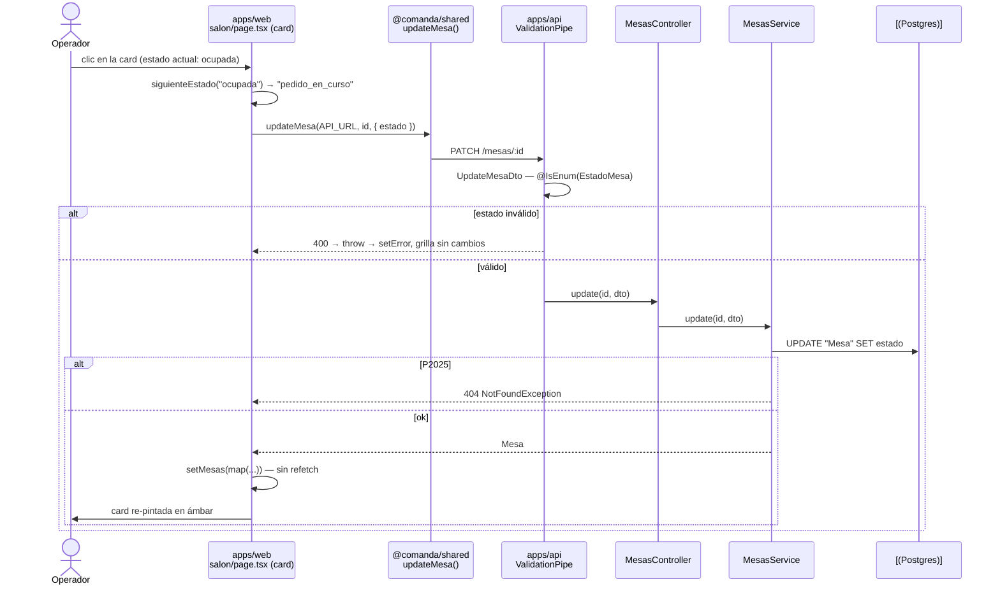

# Design: Iter 2 — Salón

## Technical Approach

One vertical slice on rails Iter 1 already laid: additive Prisma migration → `salon/mesas/` NestJS module → shared contracts → one admin page. `salon/mesas/` is a literal structural copy of `catalogo/platos/` (explicit `@Inject` tokens, class-validator DTOs behind the existing global `ValidationPipe`, P2025 → `NotFoundException`), minus the FK: `Mesa` references nothing, so there is no `assertCategoriaExists` analogue and the service is strictly smaller than `PlatosService`. No new dependency, no new pattern, no toolchain step — the Jest runner from Iter 1 makes RED-first possible on day one.

## Architecture Decisions

| Decision | Choice | Rejected | Rationale |
|---|---|---|---|
| `estado` type | Prisma native `enum EstadoMesa`, default `libre` | `String` + app-side check; lookup table | DB rejects invalid values without app code; Prisma generates the TS union for free |
| Estado endpoint | Reuse `PATCH /mesas/:id` with `{ estado }` | Dedicated `PATCH /mesas/:id/estado` | `estado` is an ordinary column this iteration — no transition rules to guard. Iter 3 adds the endpoint when the rules exist |
| Estado control | Click the card itself → advance to the next state in the fixed cycle `libre → ocupada → pedido_en_curso → libre` | Per-card `<select>` for direct jumps | Required by `specs/salon-admin/spec.md` §"Cycle occupancy state by clicking a card" (MUST), matches the proposal §Scope sketch, and confirmed explicitly by the user. One click per advance, no extra chrome in the card |
| Card element | The clickable card is a native `<button>`; `Editar`/`Eliminar` are **siblings**, not children | `<div onClick>`; buttons nested inside the card | `<button>` gives Enter/Space, focus ring and `role=button` for free. Nested interactive elements are invalid HTML — hence the siblings |
| Estado legend | Color **plus** text label in every card | Color only | Color alone fails WCAG 1.4.1; a cycle with no visible current-state name is unreadable. The label is one `<span>` |
| Tenancy | `orgId`/`sucursalId` nullable, never written, never filtered | Enforce now | `tenancy-columns` decision from Iter 1 — columns are free now, migrations are not |
| `capacidad` | `Int`, `@Min(1)`, required on create | Optional/nullable | Unused until Iter 3 by design (proposal §Risks); a required column avoids a backfill |
| Shared wrappers | `listMesas(baseUrl)` with no filter arg | `listMesas(baseUrl, estado?)` | No caller needs it; `/salon` filters in memory |

## Data Flow

```
apps/web /salon ──→ @comanda/shared (fetch) ──→ apps/api ValidationPipe
                                                      │
                                                      ▼
                                                MesasService
                                                      │
                                            PrismaService ──→ Postgres 16
```

### Sequence: operator asserts `pedido_en_curso`



## File Changes

| File | Action | Description |
|---|---|---|
| `apps/api/prisma/schema.prisma` | Modify | `enum EstadoMesa` + `model Mesa` (below) |
| `apps/api/prisma/migrations/**` | Create | One additive migration (`migrate dev`) — `Categoria`/`Plato` untouched |
| `apps/api/src/salon/mesas/mesas.{module,controller,service}.ts` | Create | CRUD `/mesas` |
| `apps/api/src/salon/mesas/dto/{create,update}-mesa.dto.ts` | Create | class-validator DTOs |
| `apps/api/src/salon/mesas/mesas.service.spec.ts` | Create | RED-first unit suite |
| `apps/api/src/app.module.ts` | Modify | append `MesasModule` to `imports` |
| `packages/shared/src/index.ts` | Modify | `EstadoMesa`, `Mesa`, inputs, 4 wrappers |
| `apps/web/app/salon/page.tsx` | Create | Grid + CRUD screen |
| `openspec/config.yaml` | Modify | refresh stale `context:` block (predates Iter 1) |

## Interfaces / Contracts

```prisma
enum EstadoMesa {
  libre
  ocupada
  pedido_en_curso
}

model Mesa {
  id         String     @id @default(uuid())
  nombre     String
  capacidad  Int
  estado     EstadoMesa @default(libre)
  orgId      String?
  sucursalId String?
  createdAt  DateTime   @default(now())
  updatedAt  DateTime   @updatedAt
}
```

| Method | Path | Body | Success | Errors |
|---|---|---|---|---|
| POST | `/mesas` | `CreateMesaDto` | 201 `Mesa` | 400 |
| GET | `/mesas` | — | 200 `Mesa[]` | — |
| PATCH | `/mesas/:id` | `UpdateMesaDto` | 200 `Mesa` | 400, 404 |
| DELETE | `/mesas/:id` | — | 200 | 404 |

DTOs: `CreateMesaDto { nombre: @IsString @IsNotEmpty; capacidad: @IsInt @Min(1); estado?: @IsOptional @IsEnum(EstadoMesa) }`; `UpdateMesaDto` is the same with every field `@IsOptional()` (hand-written, no `@nestjs/mapped-types`). `MesasService`: `create` (no FK pre-check), `findAll()` → `findMany({})`, `update`/`remove` wrapping Prisma in the same `isNotFoundError` P2025 guard as `PlatosService`.

```ts
// packages/shared/src/index.ts — added exports
export type EstadoMesa = "libre" | "ocupada" | "pedido_en_curso";
export interface Mesa { id: string; nombre: string; capacidad: number; estado: EstadoMesa;
  orgId: string | null; sucursalId: string | null; createdAt: string; updatedAt: string; }
export type CreateMesaInput = { nombre: string; capacidad: number; estado?: EstadoMesa };
export type UpdateMesaInput = Partial<CreateMesaInput>;

export function listMesas(baseUrl: string): Promise<Mesa[]>;
export function createMesa(baseUrl: string, input: CreateMesaInput): Promise<Mesa>;
export function updateMesa(baseUrl: string, id: string, input: UpdateMesaInput): Promise<Mesa>;
export function deleteMesa(baseUrl: string, id: string): Promise<void>;
```

`baseUrl` first, `Content-Type: application/json`, reusing the existing `parseJsonOrThrow` / `throwIfNotOk` helpers — identical to the `Plato` wrappers.

### `apps/web/app/salon/page.tsx`

Single `"use client"` component, no UI library, inline styles, native `<form>`. State: `mesas: Mesa[]`, `form: { nombre: string; capacidad: string }`, `editandoMesaId: string | null`, `error: string | null`, `cargando: boolean`.

`useEffect` on mount → `listMesas`. Two sections:

1. **Grilla** — `<ul>` with `style={{ display: "grid", gridTemplateColumns: "repeat(auto-fill, minmax(180px, 1fr))", gap: "0.75rem" }}`. Each `<li>` holds a card `<button>` (showing `nombre`, `capacidad` and the estado label, background from `COLOR_ESTADO`) plus sibling `Editar` / `Eliminar` buttons. Clicking the card calls `handleCiclarEstado(mesa)` → `updateMesa(API_URL, mesa.id, { estado: siguienteEstado(mesa.estado) })`, then `setMesas(mesas.map(...))` — no refetch. On failure: `setError(...)` and the card keeps its previous color (spec §"Failed state cycle shows error"), which falls out of updating state only from the resolved response.

```ts
const COLOR_ESTADO: Record<EstadoMesa, string> = {
  libre: "#e8f5e9",           // verde — disponible
  ocupada: "#ffebee",         // rojo — comensales sentados
  pedido_en_curso: "#fff8e1", // ámbar — aseverado por el operador
};

// Ciclo fijo; pedido_en_curso es aseverado por el operador, nada lo dispara solo.
const SIGUIENTE_ESTADO: Record<EstadoMesa, EstadoMesa> = {
  libre: "ocupada",
  ocupada: "pedido_en_curso",
  pedido_en_curso: "libre",
};
```

2. **CRUD** — one `<form>` for `nombre` + `capacidad` (`type="number"`, `min={1}`, parsed with `Number.parseInt`), create/edit/cancel/delete against local state, mirroring `catalogo/page.tsx` exactly. `estado` is never in this form; it changes only from a card.

`API_URL` from `process.env.NEXT_PUBLIC_API_URL ?? "http://localhost:3001"`.

## Testing Strategy

| Layer | What to Test | Approach |
|---|---|---|
| Unit (api) — RED first | `create` defaults `estado` to `libre` when omitted and honours it when sent; `findAll` → `findMany({})`; `update` persists each of the three `estado` values; `update`/`remove` map P2025 → `NotFoundException`; `remove` returns the deleted row | `Test.createTestingModule({ providers: [MesasService, { provide: PrismaService, useValue: prisma }] })` with `prisma.mesa.{create,findMany,update,delete}` as `jest.fn()`, `jest.resetAllMocks()` in `beforeEach` — same shape as `platos.service.spec.ts` |
| Integration | `ValidationPipe` rejects `capacidad: 0`, a non-enum `estado` and unknown fields with 400 | `Test.createTestingModule` + supertest against dev Postgres |
| Manual | `/salon` grid colors, three clicks on one card return it to `libre`, keyboard Enter/Space cycles the focused card, CRUD round-trip | Browser against `pnpm dev` |

Every service test is authored and observed failing before the corresponding `MesasService` method exists (`rules.apply.tdd: true`, `pnpm --filter api test`).

## Threat Matrix

N/A — no routing, shell, subprocess, VCS/PR automation, executable-file classification, or process-integration boundary. The single trust boundary is the HTTP body, covered by the global `ValidationPipe` (`whitelist` + `forbidNonWhitelisted`) plus the DB-level enum.

## Migration / Rollout

One additive migration creating `EstadoMesa` and `Mesa`; no existing table altered, no prior Mesa data, so `prisma migrate reset` is lossless. No feature flag, no phased rollout. `docker compose up -d` before `migrate dev`.

## Open Questions

- [ ] None blocking. `nombre` ships **without** a unique constraint — uniqueness is only meaningful per `sucursalId`, and that scope does not exist until tenancy is enforced.
- [ ] `pedido_en_curso` stays operator-asserted with no automatic driver; Iter 3 wires the real transition without a schema change.
