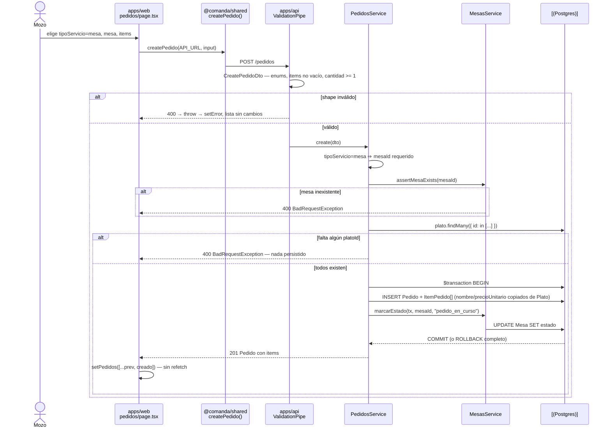

# Design: Iter 3 — Pedidos

## Technical Approach

Same vertical slice as Iter 1/2 — additive migration → `pedidos/` NestJS module → shared contracts → one admin page — plus the one genuinely new thing: the first service-to-service call in the repo. `pedidos/` is copied structurally from `salon/mesas/` (explicit `@Inject` tokens, class-validator DTOs behind the global `ValidationPipe`, P2025 → `NotFoundException`), and adds two things `MesasService` never needed: FK pre-checks in the `PlatosService.assertCategoriaExists` shape, and a transition guard. No new dependency, no state-machine library, no events.

Correction to the proposal's §Affected Areas: **`apps/api/src/salon/salon.module.ts` does not exist.** `MesasModule` is registered directly in `app.module.ts`. The export therefore lands on `MesasModule`, not on a wrapper module, and no `SalonModule` is created (YAGNI — one module in the domain).

## Architecture Decisions

| Decision | Choice | Rejected | Rationale |
|---|---|---|---|
| **Transition map** | `const SIGUIENTE: Record<EstadoPedido, EstadoPedido \| null>`, `cerrado → null`. Guard: `if (SIGUIENTE[actual] !== destino) throw new BadRequestException(...)` | `Record<EstadoPedido, EstadoPedido[]>` (proposal sketch); `xstate`/any FSM lib | The chain is strictly linear: every state has exactly one successor, so every array would be a singleton — a shape that is always length ≤1 is not a set. The single-successor map is also exactly what the UI needs (`SIGUIENTE[estado]` *is* the next-button target; the array form needs `[0]`). A lib is rejected under YAGNI per exploration. Widening to `EstadoPedido[]` is a one-line change the day branching exists |
| **Cross-module coupling** | `MesasModule` gains `exports: [MesasService]`; `PedidosModule` imports `MesasModule`. `PedidosService` injects `MesasService` and uses **two narrow methods only** (`assertMesaExists`, `marcarEstado`) | `PedidosService` injecting `PrismaService` and writing `prisma.mesa` itself; domain events over Redis/EventEmitter | Direct DI is the confirmed product decision (`acople-mesa`). Events are Iter 4 territory: an event bus with one producer and one consumer is indirection with no second subscriber to justify it, and it would make the atomicity below impossible. Going through `MesasService` keeps `Mesa` writes owned by the salon module — `pedidos` never touches `prisma.mesa`. Direction is fixed one-way `pedidos → salon`; `MesasService` gains no knowledge of `Pedido` |
| **Transaction boundary** | Interactive `this.prisma.$transaction(async (tx) => { ... })` wrapping the `Pedido` + `ItemPedido` write **and** the `Mesa.estado` write. `MesasService.marcarEstado(tx, mesaId, estado)` takes the `Prisma.TransactionClient` as its first argument | Array form `$transaction([a, b])`; two sequential awaits | The array form is not available: `MesasService`'s methods are `async` wrappers around the P2025 try/catch, so they return plain `Promise`s, not the `PrismaPromise`s `$transaction([])` requires. The interactive form also lets the `cerrado` branch read the pedido and decide inside the same transaction. Two sequential awaits are the drift risk the proposal names |
| **`ItemPedido.platoId` FK** | `onDelete: Restrict` (Prisma's default for a required relation — declared explicitly for intent). **`PlatosService.remove` must map P2003 → `ConflictException` (409)** | `SetNull`; `Cascade` | `DELETE /platos/:id` is a live path (`apps/web/app/catalogo/page.tsx:115` → `deletePlato`). `SetNull` needs a nullable `platoId`, discards the only link back to the catálogo, and lets the delete silently succeed. `Cascade` would delete order history. Restrict is the honest answer: you cannot delete a `Plato` an order references. Without the P2003 mapping the existing `isNotFoundError` guard misses it and the endpoint 500s — this is a **required change to `PlatosService`, not optional polish** |
| **`Pedido.mesaId` FK** | `onDelete: Restrict`; same P2003 → 409 mapping in `MesasService.remove` | Prisma's default `SetNull` for optional relations | `SetNull` would produce a `tipoServicio=mesa` pedido with `mesaId = null`, breaking the invariant the DTO guard exists to protect. Same rule as above, applied consistently |
| **`tipoServicio` guard** | Service-level, in `PedidosService.create`, alongside the FK checks | DTO-level `@ValidateIf` | The rule is conditional *and* needs a DB read (`mesaId` must exist, not merely be present). Splitting half into the DTO and half into the service means two places to read. The DTO validates shapes; the service validates the domain — same split `PlatosService` already uses |
| **Transition endpoint** | Dedicated `PATCH /pedidos/:id/estado` | Reuse `PATCH /pedidos/:id` with `{ estado }` (the Iter 2 choice) | Iter 2 explicitly deferred this: "Iter 3 adds the endpoint when the rules exist." The rules now exist |
| **Map location** | `apps/api/src/pedidos/estado-pedido.ts` (api) + mirrored union in `packages/shared` | Single source in `packages/shared` | `apps/api` does not depend on `@comanda/shared` (see its `package.json`). Same accepted duplication as `EstadoMesa` in Iter 2; adding the dep to reuse 8 lines is the larger change |
| Tenancy | `orgId`/`sucursalId` nullable, never written, never filtered | Enforce now | `tenancy-columns`, unchanged since Iter 1 |

## Data Flow

```
apps/web /pedidos ──→ @comanda/shared (fetch) ──→ apps/api ValidationPipe
                                                        │
                                                        ▼
                                                 PedidosService ──→ MesasService
                                                        │                 │
                                                        └── $transaction ─┘
                                                                │
                                                        PrismaService ──→ Postgres 16
```

### Sequence: create a `tipoServicio=mesa` pedido (price snapshot + mesa coupling)



`PATCH /pedidos/:id/estado` mirrors this: guard first, then a transaction that updates `Pedido.estado` and — only when the target is `cerrado` and `tipoServicio=mesa` — calls `marcarEstado(tx, mesaId, "libre")`. Every other transition writes `Pedido` only.

## File Changes

| File | Action | Description |
|---|---|---|
| `apps/api/prisma/schema.prisma` | Modify | `EstadoPedido`, `TipoServicio`, `Pedido`, `ItemPedido`; `Mesa` gains a back-relation field only |
| `apps/api/prisma/migrations/**` | Create | One additive migration — `Categoria`/`Plato`/`Mesa` columns untouched |
| `apps/api/src/pedidos/estado-pedido.ts` | Create | `SIGUIENTE` map + `assertTransicionValida` |
| `apps/api/src/pedidos/pedidos.{module,controller,service}.ts` | Create | `/pedidos` |
| `apps/api/src/pedidos/dto/{create-pedido,update-estado-pedido}.dto.ts` | Create | class-validator DTOs |
| `apps/api/src/pedidos/pedidos.service.spec.ts` | Create | RED-first unit suite |
| `apps/api/src/salon/mesas/mesas.module.ts` | Modify | add `exports: [MesasService]` |
| `apps/api/src/salon/mesas/mesas.service.ts` | Modify | add `assertMesaExists`, `marcarEstado(tx, ...)`; map P2003 → 409 in `remove` |
| `apps/api/src/catalogo/platos/platos.service.ts` | Modify | map P2003 → 409 in `remove` |
| `apps/api/src/app.module.ts` | Modify | append `PedidosModule` |
| `packages/shared/src/index.ts` | Modify | `EstadoPedido`, `TipoServicio`, `Pedido`, `ItemPedido`, inputs, `SIGUIENTE_ESTADO_PEDIDO`, 3 wrappers |
| `apps/web/app/pedidos/page.tsx` | Create | Admin screen |
| `openspec/config.yaml` | Modify | refresh `context:` with the `pedidos` module |

## Interfaces / Contracts

```prisma
enum TipoServicio { mesa barra }

enum EstadoPedido {
  abierto
  enviado_a_cocina
  en_preparacion
  listo
  entregado
  cobrado
  cerrado
}

model Pedido {
  id           String       @id @default(uuid())
  tipoServicio TipoServicio
  mesaId       String?
  mesa         Mesa?        @relation(fields: [mesaId], references: [id], onDelete: Restrict)
  estado       EstadoPedido @default(abierto)
  items        ItemPedido[]
  orgId        String?
  sucursalId   String?
  createdAt    DateTime     @default(now())
  updatedAt    DateTime     @updatedAt
}

model ItemPedido {
  id             String @id @default(uuid())
  pedidoId       String
  pedido         Pedido @relation(fields: [pedidoId], references: [id], onDelete: Cascade)
  platoId        String
  plato          Plato  @relation(fields: [platoId], references: [id], onDelete: Restrict)
  nombre         String // snapshot de Plato.nombre al crear
  precioUnitario Int    // snapshot de Plato.precio (centavos) al crear
  cantidad       Int
}
```

`Mesa` gains `pedidos Pedido[]` and `Plato` gains `itemsPedido ItemPedido[]` — back-relation fields only, no column.

```ts
// apps/api/src/pedidos/estado-pedido.ts
export const SIGUIENTE: Record<EstadoPedido, EstadoPedido | null> = {
  abierto: "enviado_a_cocina",
  enviado_a_cocina: "en_preparacion",
  en_preparacion: "listo",
  listo: "entregado",
  entregado: "cobrado",
  cobrado: "cerrado",
  cerrado: null, // terminal
};
```

| Method | Path | Body | Success | Errors |
|---|---|---|---|---|
| POST | `/pedidos` | `CreatePedidoDto` | 201 `Pedido` (con `items`) | 400 |
| GET | `/pedidos` | — | 200 `Pedido[]` (con `items`) | — |
| PATCH | `/pedidos/:id/estado` | `{ estado }` | 200 `Pedido` | 400 (transición ilegal), 404 |

`CreatePedidoDto { tipoServicio: @IsEnum(TipoServicio); mesaId?: @IsOptional @IsUUID; items: @IsArray @ArrayNotEmpty @ValidateNested({each:true}) @Type(() => CreateItemPedidoDto) }`; `CreateItemPedidoDto { platoId: @IsUUID; cantidad: @IsInt @Min(1) }`; `UpdateEstadoPedidoDto { estado: @IsEnum(EstadoPedido) }`. Hand-written, no `@nestjs/mapped-types`, matching Iter 1/2.

```ts
// packages/shared/src/index.ts — added exports
export type TipoServicio = "mesa" | "barra";
export type EstadoPedido = "abierto" | "enviado_a_cocina" | "en_preparacion"
  | "listo" | "entregado" | "cobrado" | "cerrado";
export interface ItemPedido { id: string; pedidoId: string; platoId: string;
  nombre: string; precioUnitario: number; cantidad: number; }
export interface Pedido { id: string; tipoServicio: TipoServicio; mesaId: string | null;
  estado: EstadoPedido; items: ItemPedido[]; orgId: string | null;
  sucursalId: string | null; createdAt: string; updatedAt: string; }
export type CreatePedidoInput = { tipoServicio: TipoServicio; mesaId?: string;
  items: { platoId: string; cantidad: number }[] };

export const SIGUIENTE_ESTADO_PEDIDO: Record<EstadoPedido, EstadoPedido | null>;
export function listPedidos(baseUrl: string): Promise<Pedido[]>;
export function createPedido(baseUrl: string, input: CreatePedidoInput): Promise<Pedido>;
export function avanzarEstadoPedido(baseUrl: string, id: string, estado: EstadoPedido): Promise<Pedido>;
```

`baseUrl` first, reusing the existing `parseJsonOrThrow` / `throwIfNotOk` helpers — identical to the `Mesa` wrappers. No `deletePedido` wrapper: there is no `DELETE /pedidos/:id` this iteration.

### `apps/web/app/pedidos/page.tsx`

Single `"use client"` component, no UI library, inline styles, native `<form>`, `API_URL` from `process.env.NEXT_PUBLIC_API_URL ?? "http://localhost:3001"`. State: `pedidos`, `mesas`, `platos`, `form: { tipoServicio, mesaId, items: { platoId, cantidad }[] }`, `error`, `cargando`. `useEffect` on mount fires `listPedidos`, `listMesas` and `listPlatos` together.

1. **Alta** — `<select>` for `tipoServicio`; the `mesaId` `<select>` renders **only** when `tipoServicio === "mesa"` (mirrors the server guard rather than duplicating its logic), listing `estado === "libre"` mesas. A repeatable row adds `platoId` + `cantidad` lines from the `Plato` list; the running total is `centavosToPesos(Σ precio × cantidad)` — display only, the server is what snapshots.
2. **Lista** — one card per pedido showing `estado`, `tipoServicio`, its items (`nombre` × `cantidad` at `centavosToPesos(precioUnitario)` — the snapshot, never a live `Plato` lookup) and the line total. A single **`Avanzar a {SIGUIENTE_ESTADO_PEDIDO[estado]}`** button; when the value is `null` (`cerrado`) the button is **not rendered**. Deliberate contrast with Iter 2's free 3-state cycle: forward-only, no jumps, no wrap-around. On resolve, `setPedidos(map(...))`; on failure `setError(...)` and the card keeps its previous estado.

## Testing Strategy

| Layer | What to Test | Approach |
|---|---|---|
| Unit (api) — RED first | `create`: snapshots `nombre`/`precioUnitario` from `Plato` (asserts the value copied, not a live read); rejects an unknown `platoId` with 400 persisting nothing; `tipoServicio=mesa` without `mesaId` → 400; `tipoServicio=barra` **with** `mesaId` → 400; unknown `mesaId` → 400; on success calls `marcarEstado` with `pedido_en_curso` **inside** the `$transaction` callback. `updateEstado`: table-driven over **every** `(actual, destino)` pair — the 6 legal ones pass, all others 400 (covers `abierto → listo` and the terminal `cerrado`); reaching `cerrado` on a `mesa` pedido calls `marcarEstado(..., "libre")`; on a `barra` pedido it does **not**; P2025 → `NotFoundException` | `Test.createTestingModule({ providers: [PedidosService, { provide: PrismaService, useValue: prisma }, { provide: MesasService, useValue: mesas }] })`, extending `mesas.service.spec.ts` exactly: `mesas = { assertMesaExists: jest.fn(), marcarEstado: jest.fn() }`, `prisma.{pedido,itemPedido,plato}.*` as `jest.fn()`, `jest.resetAllMocks()` in `beforeEach`. `prisma.$transaction: jest.fn(async (cb) => cb(prisma))` — the callback runs against the same mock, so a `marcarEstado` assertion proves it was invoked with the tx client |
| Unit (api) | `PlatosService.remove` / `MesasService.remove` map P2003 → `ConflictException` | `mockRejectedValue({ code: "P2003" })`, same shape as the existing P2025 tests |
| Integration | `ValidationPipe` rejects `items: []`, `cantidad: 0`, unknown enum values and unknown fields with 400; `Plato.precio` edited after an order leaves `ItemPedido.precioUnitario` untouched | `Test.createTestingModule` + supertest against dev Postgres |
| Manual | `/pedidos` creates a mesa pedido → that mesa turns amber in `/salon`; advancing to `cerrado` returns it to `libre`; the manual `PATCH /mesas/:id` card-click cycle from Iter 2 still works | Browser against `pnpm dev` |

Every service test is authored and observed failing before the corresponding `PedidosService` method exists (`rules.apply.tdd: true`, `pnpm --filter api test`).

## Threat Matrix

N/A — no routing, shell, subprocess, VCS/PR automation, executable-file classification, or process-integration boundary. The only trust boundary is the HTTP body: global `ValidationPipe` (`whitelist` + `forbidNonWhitelisted`), DB-level enums, service-level FK and transition guards.

## Migration / Rollout

One additive migration creating two enums and two tables; no existing column is altered and no prior `Pedido` data exists, so a down-migration or `prisma migrate reset` is lossless. No feature flag, no phased rollout. `docker compose up -d` before `migrate dev`.

## Open Questions

- [ ] None blocking.
- [ ] The transition map ships as `Record<EstadoPedido, EstadoPedido | null>`, **narrower than the `EstadoPedido[]` sketched in `proposal.md` §Scope**. The spec must describe the behavior (one legal successor per state) rather than the container type, so the two artifacts stay consistent.
- [ ] `cobrado` remains operator-asserted with no real driver until Iter 6 — the same accepted tradeoff Iter 2 made for `pedido_en_curso`.
- [ ] No `DELETE /pedidos/:id` this iteration; `onDelete: Cascade` on `ItemPedido.pedidoId` is declared for schema correctness but has no caller yet.
