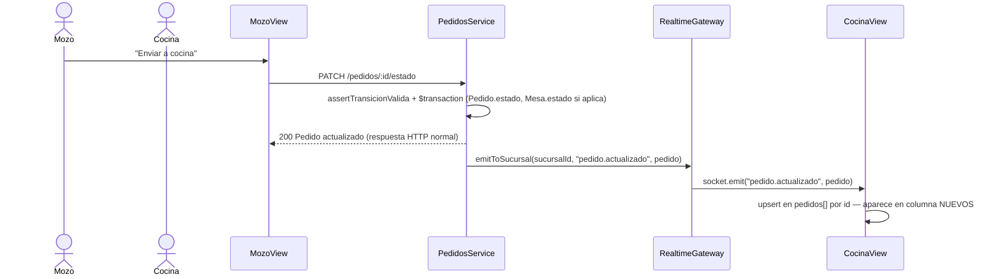

# Design: Iter 4 — Tiempo real

## Technical Approach

Un gateway Socket.io por proceso, con Redis como adapter para que N instancias del backend compartan las mismas salas (arquitectura §4.2: "puede haber varias instancias, Redis hace de pub/sub"). Cada socket se autentica una vez en el handshake con el mismo JWT que ya usa HTTP (`JwtService.verify`, sin librería nueva) y se une a una sala por sucursal — reutiliza el aislamiento multi-tenant que `TenantContext` ya impone en las queries HTTP, ahora también en el broadcast. Los servicios de dominio no aprenden Socket.io: inyectan `RealtimeGateway` y llaman un solo método, `emitToSucursal(sucursalId, evento, payload)`.

## Architecture Decisions

| Decisión | Elección | Rechazado | Razón |
|---|---|---|---|
| **Forma de los eventos** | 3 eventos por entidad (`pedido.actualizado`, `mesa.actualizada`, `plato.actualizado`) con el objeto completo como payload | Eventos granulares por transición (`PedidoEnviadoACocina`, `PedidoListo`, ...) como nombra `sistema-gestion-gastronomico.md` §7.3 | El cliente solo necesita el estado actual para upsertear su lista local — ya lo hace así al resolver una promesa HTTP. Eventos por transición exigirían que cada handler sepa reconstruir el objeto completo o el cliente haga un fetch extra; el objeto completo es lo que ya circula por HTTP, cero contratos nuevos que aprender. Es más barato desde YAGNI y sigue siendo la base sobre la que un evento más granular se puede agregar después sin romper nada |
| **Alcance del emit en pedidos** | El `$transaction` de `PedidosService` devuelve `{ pedido, mesa }`; el emit ocurre **después** de que la transacción resuelve, no dentro del callback | Emitir dentro del `tx` callback | Un emit dentro de la transacción se dispara aunque después haya un rollback (aunque hoy nada falla después del `tx.mesa.update`, es una garantía barata de mantener). Emitir post-commit es la única forma correcta de "avisá lo que de verdad pasó" |
| **Autenticación del socket** | JWT en `handshake.auth.token`, verificado una vez en `handleConnection` con el `JwtService` existente; `client.join(`sucursal:${claims.sucursalId}`)` | Cookie de sesión; revalidar el token en cada mensaje | Reutiliza el mecanismo HTTP tal cual, cero superficie nueva de autenticación. Revalidar por mensaje es trabajo que Socket.io no necesita para esta escala — la conexión ya es el equivalente de una sesión persistente |
| **Redis adapter** | `@socket.io/redis-adapter` + cliente `redis` v4, conectado en `main.ts` antes de `app.listen`, vía una `RedisIoAdapter extends IoAdapter` | Sin adapter, un solo proceso en memoria | El pub/sub entre instancias es el desafío técnico que nombra el propio doc de arquitectura — no es over-engineering, es el punto central del proyecto. Queda transparente en dev (una sola instancia) y listo para escalar sin cambiar código de dominio |
| **Quién inyecta el gateway** | `PedidosService`, `MesasService`, `PlatosService` reciben `RealtimeGateway` por DI, mismo patrón que ya usan con `PrismaService` | Un `EventEmitter`/bus de dominio interno que el gateway escucha | Un bus indirecto es una capa extra sin un segundo consumidor que lo justifique — mismo argumento que Iter 3 usó para rechazar eventos en vez de DI directa en el acople pedidos↔salón. Cuando exista un segundo consumidor de estos eventos (ej. un audit log), ahí se justifica el bus |
| **`RealtimeModule` global** | `@Global()`, igual que `AuthModule`, importado una vez en `AppModule` | Import explícito en `PedidosModule`/`MesasModule`/`PlatosModule` | Ya hay un precedente idéntico en este mismo repo (`AuthModule`); evita repetir el import en 3 módulos para algo que es infraestructura transversal, no dominio |
| **Cliente** | Un socket por sesión de `apps/operativa`/`apps/web`, conectado con el `accessToken` ya guardado; `packages/shared` expone `connectRealtime(baseUrl, token): Socket` | Un hook/contexto de React compartido | `packages/shared` ya es "contratos + cliente API, sin runtime deps de framework" — no tiene React. Un wrapper de React (hook) es responsabilidad de cada app, no del paquete compartido; cada vista ya maneja su propio `useEffect` de conexión, mismo patrón que el fetch inicial |

## Data Flow

```
apps/operativa (Mozo)                    apps/operativa (Cocina)
        │  connectRealtime(token)                 │  connectRealtime(token)
        ▼                                          ▼
   Socket.io client ───────────┐      ┌─────────── Socket.io client
                                ▼      ▼
                         RealtimeGateway (Nest)
                         handleConnection: JWT verify → join sucursal:<id>
                                │
                    PedidosService / MesasService / PlatosService
                                │  emitToSucursal(sucursalId, evento, payload)
                                ▼
                    gateway.server.to(sala).emit(evento, payload)
                                │
                         Redis adapter (pub/sub) ── otra instancia del backend (si existe)
```

### Secuencia: Mozo envía un pedido a cocina, Cocina lo ve sin refrescar



## File Changes

| File | Acción | Descripción |
|---|---|---|
| `apps/api/src/realtime/realtime.gateway.ts` | Crear | `@WebSocketGateway`, `handleConnection`, `emitToSucursal` |
| `apps/api/src/realtime/realtime.module.ts` | Crear | `@Global()`, provee y exporta `RealtimeGateway` |
| `apps/api/src/realtime/realtime.gateway.spec.ts` | Crear | unit tests, mock de `Socket` y `JwtService` |
| `apps/api/src/realtime/redis-io.adapter.ts` | Crear | `IoAdapter` con `createAdapter` de `@socket.io/redis-adapter` |
| `apps/api/src/main.ts` | Modificar | instanciar y conectar `RedisIoAdapter` antes de `app.listen` |
| `apps/api/src/app.module.ts` | Modificar | importar `RealtimeModule` |
| `apps/api/src/pedidos/pedidos.service.ts` | Modificar | inyectar `RealtimeGateway`; `$transaction` devuelve `{ pedido, mesa }`; emitir tras resolver |
| `apps/api/src/pedidos/pedidos.service.spec.ts` | Modificar | mock de `RealtimeGateway`, aserciones de emisión |
| `apps/api/src/salon/mesas/mesas.service.ts` | Modificar | inyectar `RealtimeGateway`; emitir en `create`/`update` |
| `apps/api/src/salon/mesas/mesas.service.spec.ts` | Modificar | ídem |
| `apps/api/src/catalogo/platos/platos.service.ts` | Modificar | inyectar `RealtimeGateway`; emitir en `update` |
| `apps/api/src/catalogo/platos/platos.service.spec.ts` | Modificar | ídem |
| `apps/api/.env.example` | Modificar | agregar `REDIS_URL=redis://localhost:6379` |
| `packages/shared/src/index.ts` | Modificar | `connectRealtime(baseUrl, accessToken): Socket` |
| `apps/operativa/src/MozoView.tsx` | Modificar | quitar `setInterval`; listeners `pedido.actualizado`, `mesa.actualizada` |
| `apps/operativa/src/CocinaView.tsx` | Modificar | quitar `setInterval`; listeners `pedido.actualizado`, `plato.actualizado` |
| `apps/web/app/salon/page.tsx` | Modificar | listener `mesa.actualizada` |

## Interfaces / Contracts

```ts
// apps/api/src/realtime/realtime.gateway.ts
@WebSocketGateway({ cors: { origin: "*" } })
export class RealtimeGateway implements OnGatewayConnection {
  @WebSocketServer() server: Server;
  constructor(@Inject(JwtService) private readonly jwt: JwtService) {}

  handleConnection(client: Socket): void {
    try {
      const token = client.handshake.auth?.token as string | undefined;
      if (!token) throw new Error("missing token");
      const { sucursalId } = this.jwt.verify(token);
      client.join(sala(sucursalId));
    } catch {
      client.disconnect(true);
    }
  }

  emitToSucursal(sucursalId: string, evento: string, payload: unknown): void {
    this.server.to(sala(sucursalId)).emit(evento, payload);
  }
}

function sala(sucursalId: string): string {
  return `sucursal:${sucursalId}`;
}
```

```ts
// packages/shared/src/index.ts — agregado
export function connectRealtime(baseUrl: string, accessToken: string) {
  return io(baseUrl, { auth: { token: accessToken }, transports: ["websocket"] });
}
```

Eventos emitidos (payload = el objeto completo, mismo shape que su contraparte HTTP):

| Evento | Emisor | Payload |
|---|---|---|
| `pedido.actualizado` | `PedidosService.create`, `PedidosService.updateEstado` | `Pedido` (con `items`) |
| `mesa.actualizada` | `MesasService.create`, `MesasService.update`, driver automático en `PedidosService` | `Mesa` |
| `plato.actualizado` | `PlatosService.update` | `Plato` |

## Testing Strategy

| Capa | Qué testear | Cómo |
|---|---|---|
| Unit — RED first | `RealtimeGateway.handleConnection`: token válido → `client.join("sucursal:<id>")`; token ausente/inválido → `client.disconnect(true)`, nunca `join` | Mock de `Socket` (`{ handshake, join: jest.fn(), disconnect: jest.fn() }`) y de `JwtService` (`{ verify: jest.fn() }`) |
| Unit — RED first | `emitToSucursal` llama `server.to(sala).emit(evento, payload)` | Mock de `Server` (`{ to: jest.fn().mockReturnThis(), emit: jest.fn() }`) |
| Unit — RED first | `PedidosService.create`/`updateEstado` llaman `realtime.emitToSucursal` con el `sucursalId` del tenant, el pedido resultante, y — solo cuando `tipoServicio=mesa` — también `mesa.actualizada` | Extiende el mock existente (`mesas`, `caja`) con `realtime = { emitToSucursal: jest.fn() }` |
| Unit — RED first | `MesasService.create`/`update` y `PlatosService.update` llaman `emitToSucursal` tras el `await` a Prisma | Mismo patrón |
| Manual | Dos pestañas (mozo + cocina) logueadas; crear/avanzar un pedido en una aparece en la otra sin refrescar; togglear disponibilidad en Cocina lo refleja en Mozo; ciclar una mesa en `/salon` (web) lo refleja en Mozo | Browser contra `pnpm dev` + `docker compose up -d` |

## Migration / Rollout

Sin migración de datos. `docker compose up -d` ya expone Redis en `6379`; `REDIS_URL` nuevo en `.env.example` con ese default. Sin flag de feature — el gateway arranca con la app.

## Open Questions

- [ ] Ninguna bloqueante.
- [ ] `apps/web` `/caja` queda sin realtime esta iteración (ver Out of Scope en proposal.md) — revisar cuando se aborde el rol de caja viendo mesas en vivo (mencionado en `sistema-gestion-gastronomico.md` §5 pero no en el roadmap de MVP).
