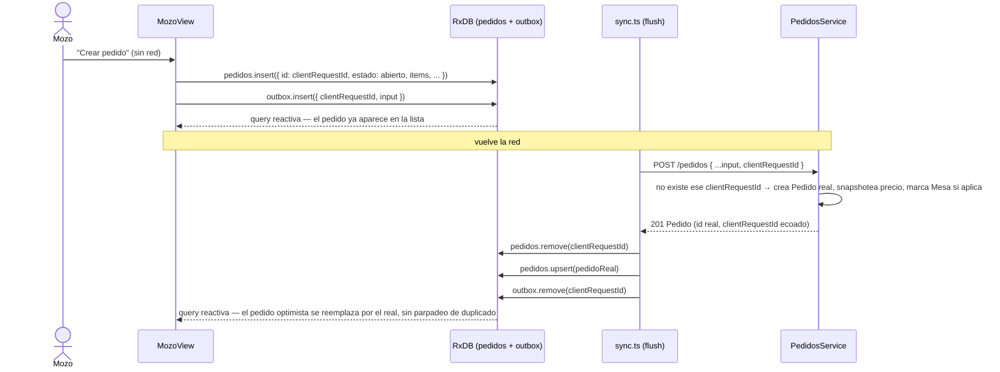

# Design: Iter 5 — Offline-first (Mozo)

## Technical Approach

RxDB (adapter Dexie/IndexedDB) como store local en `apps/operativa`, con 4 colecciones: `mesas`, `platos`, `pedidos` (espejo de lo que hoy vive en `useState`) y `outbox` (cola de pedidos creados sin red). El fetch inicial y los eventos de Socket.io (Iter 4) escriben ahí en vez de directo a `useState`; los componentes leen con queries reactivas. La única escritura offline de esta iteración es crear un `Pedido` — se inserta localmente de inmediato (UI optimista, doc de arquitectura §7.1) con un `clientRequestId` como `id` temporal, y una cola de sincronización lo reenvía al servidor cuando hay red. El servidor deduplica por `clientRequestId`, así reintentar el envío nunca crea un pedido dos veces.

## Architecture Decisions

| Decisión | Elección | Rechazado | Razón |
|---|---|---|---|
| **Store local** | RxDB + `getRxStorageDexie()` | Dexie directo | Decisión ya cerrada por el usuario para esta iteración — RxDB da queries reactivas de fábrica, que es exactamente lo que reemplaza el `useState` manual sin escribir un pub/sub propio |
| **Qué colecciones sincronizan offline en escritura** | Solo `pedidos` (creación) | Sumar también `mesas`/`platos`/avance de `estado` | El único ítem de MVP que exige offline es "carga de pedidos" (§8 del doc). Ampliar el patrón de `outbox` a más mutaciones es directo una vez que existe, pero cada una suma su propio caso de idempotencia/reconciliación — no vale sumarlos sin un caso de uso que los pida ahora |
| **Identidad del doc optimista** | El doc local usa `clientRequestId` como su `id` de RxDB; al confirmar el push, se borra ese doc y se upsertea el real bajo el `id` que asignó el servidor | Reescribir el mismo doc con el `id` del servidor (`update` en vez de `remove`+`upsert`) | RxDB no permite cambiar el `primaryKey` de un documento existente. Borrar-y-crear es la única forma correcta de "renombrar" el id sin duplicar |
| **Idempotencia en el servidor** | `Pedido.clientRequestId` único; `PedidosService.create` busca por `(clientRequestId, tenant)` antes de crear, y si existe devuelve ese pedido sin tocar `Mesa` ni volver a emitir el evento de creación | Deduplicar solo del lado cliente (no reenviar si ya se marcó como enviado) | El cliente puede marcar algo como "enviado" y perder la respuesta (la pestaña se cierra a mitad de request) y reintentar en la próxima sesión — la única garantía real de "esto no se duplica" tiene que vivir en el servidor, no en un flag optimista del cliente |
| **Qué cuenta como "hay que reintentar" vs "error real"** | Solo una falla de `fetch` en sí (network error, `TypeError`) encola en `outbox`. Una respuesta HTTP con status (400/404/409) se muestra como error al mozo de inmediato, igual que el flujo online actual | Encolar cualquier error y reintentar siempre | Reintentar un 400 para siempre nunca lo va a resolver (el payload es inválido) — solo tiene sentido reintentar lo que puede cambiar de resultado con el tiempo, que es "¿hay red o no?" |
| **Disparador de sync** | `window.addEventListener("online", flush)` + un flush al montar `MozoView` (por si quedó algo pendiente de una sesión anterior) | Polling periódico | El evento `online` del browser es exactamente la señal que hace falta — cero costo cuando no hay nada pendiente, dispara apenas vuelve la red. Polling es trabajo constante para una señal que el browser ya da gratis |
| **Snapshot de precio en el doc optimista** | El cliente arma `items` con `nombre`/`precioUnitario` leídos de la colección local `platos` (mismo criterio que hoy usa el servidor) — es solo para que la UI muestre algo coherente mientras está en cola | Mostrar el pedido offline sin desglose de precio hasta confirmar | El mozo necesita ver el total antes de confirmar el pedido con el cliente en la mesa; el servidor vuelve a snapshotear con el precio real al procesar el push, así que la UI optimista nunca es la fuente de verdad |

## Data Flow

```
apps/operativa (Mozo, offline)
    │ crea pedido
    ▼
outbox.insert({ clientRequestId, input })          pedidos.insert({ id: clientRequestId, ...optimista })
    │                                                        │
    │  (UI ya muestra el pedido — optimista)                 │
    ▼
window "online" (o mount) ──▶ flush(outbox)
    │
    ▼
POST /pedidos { ...input, clientRequestId }
    │
    ▼
PedidosService.create
    │  ¿existe Pedido con este clientRequestId + tenant?
    ├─ sí → devuelve el existente, sin tocar Mesa, sin re-emitir
    └─ no → crea, snapshotea precio real, marca Mesa si aplica, emite pedido.actualizado
    │
    ▼
apps/operativa recibe la respuesta (o el evento de socket, lo que llegue primero)
    │
    ▼
pedidos.remove(clientRequestId)  +  pedidos.upsert(pedidoDelServidor)
outbox.remove(clientRequestId)
```

### Secuencia: mozo crea un pedido sin red, se sincroniza al volver



## File Changes

| File | Acción | Descripción |
|---|---|---|
| `apps/api/prisma/schema.prisma` | Modificar | `Pedido.clientRequestId String? @unique` |
| `apps/api/prisma/migrations/**` | Crear | migración additiva |
| `apps/api/src/pedidos/dto/create-pedido.dto.ts` | Modificar | `clientRequestId?: @IsOptional @IsString` |
| `apps/api/src/pedidos/pedidos.service.ts` | Modificar | corto-circuito idempotente al inicio de `create` |
| `apps/api/src/pedidos/pedidos.service.spec.ts` | Modificar | tests RED-first de idempotencia |
| `packages/shared/src/index.ts` | Modificar | `clientRequestId` en `pedidoSchema`/`CreatePedidoInput` |
| `apps/operativa/package.json` | Modificar | `rxdb`, `rxdb`'s storage-dexie (paquete único `rxdb`, el adapter es un subpath) |
| `apps/operativa/src/db/schema.ts` | Crear | schemas RxDB (`mesas`, `platos`, `pedidos`, `outbox`) + `getDb()` singleton |
| `apps/operativa/src/db/useRxData.ts` | Crear | hook `useRxData(query)` — suscripción reactiva mínima con `useState`+`useEffect` |
| `apps/operativa/src/db/sync.ts` | Crear | `crearPedidoOffline(input)`, `flushOutbox()`, listener de `online` |
| `apps/operativa/src/MozoView.tsx` | Modificar | lee de RxDB reactivo; `handleSubmitPedido` usa `crearPedidoOffline` |
| `apps/operativa/src/CocinaView.tsx` | Modificar | lee de RxDB reactivo (sin escritura offline nueva) |

## Interfaces / Contracts

```prisma
model Pedido {
  // ...campos existentes sin cambios...
  clientRequestId String? @unique
}
```

```ts
// apps/api/src/pedidos/dto/create-pedido.dto.ts — campo agregado
export class CreatePedidoDto {
  // ...campos existentes...
  @IsOptional() @IsString() clientRequestId?: string;
}
```

```ts
// apps/api/src/pedidos/pedidos.service.ts — inicio de create()
async create(input: CreatePedidoInput, tenant: TenantContext) {
  if (input.clientRequestId) {
    const existente = await this.prisma.pedido.findFirst({
      where: { clientRequestId: input.clientRequestId, ...tenant },
      include: { items: true },
    });
    if (existente) return existente;
  }
  // ...resto del flujo sin cambios...
}
```

```ts
// apps/operativa/src/db/schema.ts
export interface PedidoOfflineDoc extends Pedido {
  clientRequestId: string | null;
  pendingSync?: boolean; // true mientras vive solo en outbox
}

export function getDb(): Promise<RxDatabase>; // singleton, crea si no existe
```

```ts
// apps/operativa/src/db/sync.ts
export async function crearPedidoOffline(input: CreatePedidoInput): Promise<void>;
// Genera clientRequestId (crypto.randomUUID()), inserta doc optimista en `pedidos`
// (id = clientRequestId, pendingSync: true) e inserta en `outbox`; intenta flush inmediato.

export async function flushOutbox(): Promise<void>;
// Por cada entrada de `outbox`: POST /pedidos; en éxito, remove(pedido optimista) + upsert(real) + remove(outbox);
// en fallo de red, deja la entrada para el próximo intento; en fallo HTTP (4xx), remove(outbox) y marca error en el doc local.
```

`Pedido` (en `packages/shared`) gana `clientRequestId: string | null` — mismo patrón que los demás campos nullable ya existentes (`mesaId`, etc.).

## Testing Strategy

| Capa | Qué testear | Cómo |
|---|---|---|
| Unit (api) — RED first | `create` con un `clientRequestId` que ya existe devuelve el pedido existente; no llama `prisma.pedido.create`; no llama `marcarEstado`; no llama `realtime.emitToSucursal` de nuevo | Extiende el mock existente de `pedidos.service.spec.ts`: `prisma.pedido.findFirst` resuelve un pedido cuando se le pasa el `clientRequestId` |
| Unit (api) — RED first | `create` sin `clientRequestId`, o con uno que no existe, sigue el flujo normal (regresión) | Casos ya cubiertos, agregar `clientRequestId: undefined` explícito a los `TENANT`/inputs existentes no debería cambiar su comportamiento |
| Manual | DevTools → Network → Offline en Mozo: crear pedido, ver que aparece optimista; volver a Online, ver que se reemplaza por el real y aparece en Cocina sin recargar | Browser contra `pnpm dev` |
| Manual | Forzar un segundo flush con el mismo `clientRequestId` (recargar la pestaña con la entrada de `outbox` todavía sin confirmar) no crea un segundo pedido | Browser + `GET /pedidos` para confirmar cantidad |

## Migration / Rollout

Migración additiva, nullable — sin impacto en datos existentes. Sin flag de feature: el flujo offline convive con el online (si hay red, el POST sale de inmediato y el `outbox` queda vacío todo el tiempo).

## Open Questions

- [ ] Ninguna bloqueante.
- [ ] Service Worker / instalación como PWA queda fuera — ver Out of Scope en proposal.md. Revisar cuando `apps/operativa` tenga su pase de diseño visual (íconos de marca).
- [ ] Avanzar `estado` offline (Cocina/Mozo) queda como candidato directo para una iteración siguiente, reusando el mismo `outbox` — no requiere rediseño, solo una segunda cola de acciones.
