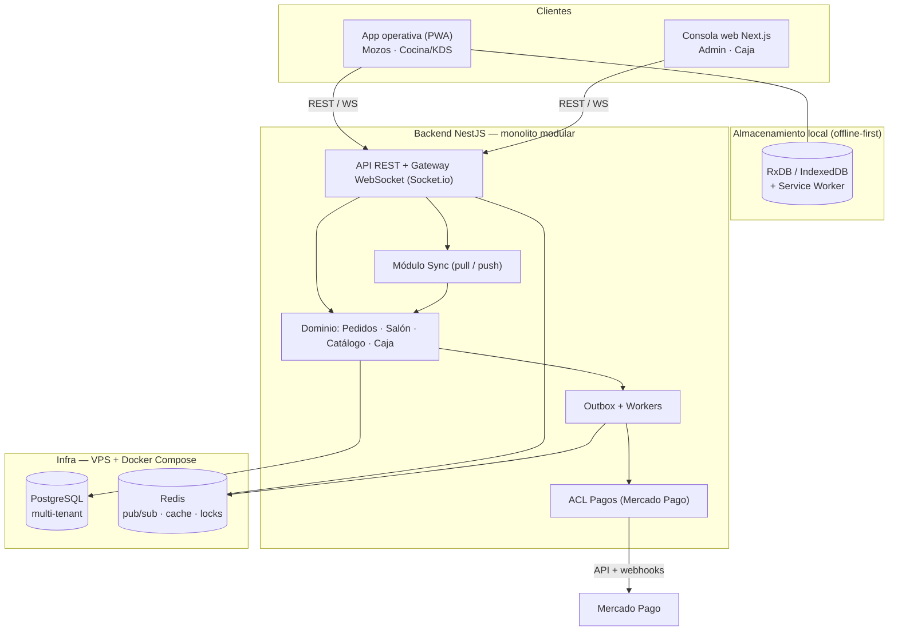
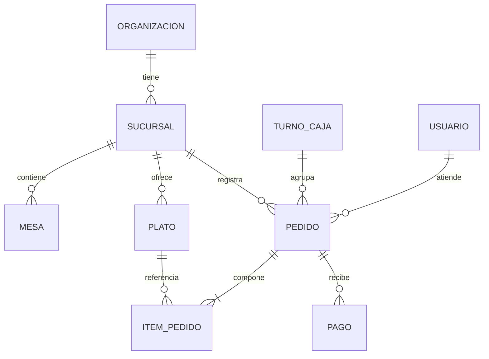
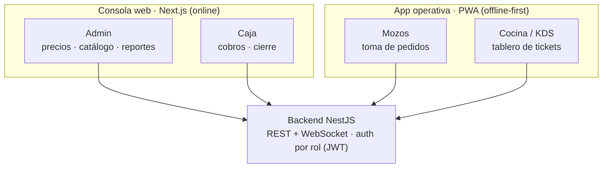

# Sistema de Gestión para Locales Gastronómicos

> Documento de refinamiento técnico — v1.1
> Contexto del proyecto: **académico + portfolio**
> Stack base: PWA (React) · NestJS · PostgreSQL · Redis · Next.js

---

## 1. La idea

Un sistema de gestión integral para bares y restaurantes **chicos y medianos**, pensado para cubrir el hueco que hoy queda entre dos extremos: los locales que se manejan con papel/Excel (pierden toda la información) y los sistemas enterprise carísimos y sobredimensionados (sobran funciones y plata).

La herramienta conecta **todo el flujo de trabajo** —desde que el mozo toma el pedido hasta que el dueño mira las estadísticas desde su casa— de forma simple y orientada a la toma de decisiones. La clave es la **trazabilidad**: saber qué pasó con cada pedido y con cada peso que entró, convirtiendo el movimiento diario en datos útiles para crecer.

El sistema se compone de dos frontends y un backend:

- Una **app operativa** (PWA instalable) usada por el personal del local: mozos (salón) y cocina (KDS, *Kitchen Display System*). Funciona offline.
- Una **consola web** (Next.js) para encargado, dueño y caja: gestión, cobros, cierre, dashboard y reportes.
- Un **backend** que procesa, persiste y sincroniza en tiempo real, e integra cobros.

Aunque hoy lo pensamos para gastronomía, el dominio se diseña de forma **extensible** para adaptarse a cualquier local con logística y atención al público.

### El verdadero desafío técnico

El CRUD de mesas y platos es lo fácil. Lo interesante —y lo que convierte esto en un buen proyecto de **sistemas distribuidos**— es mantener sincronizados en tiempo real tres "mundos" que viven en dispositivos distintos y con conectividad muchas veces de cuarta: **salón ↔ cocina ↔ caja**. De ahí salen los problemas posta: desconexiones, edición concurrente y eventos desordenados.

---

## 2. Objetivos

### General
Vincular la operación de salón y cocina con la administración del local mediante una app operativa y una consola web, para mejorar la organización del trabajo y tener datos claros del negocio.

### Específicos
- App operativa **fácil de usar** para mozos y cocina: cargar pedidos, avisar platos no disponibles y marcar tiempos de entrega en tiempo real.
- Consola web para el encargado y la caja: ver el estado del local de un vistazo, gestionar mesas, cobrar y consultar el cierre de caja.
- Información **centralizada y consistente**: stock, ventas y disponibilidad actualizados al instante, sin confusiones entre salón y cocina.
- **Reportes y estadísticas automáticos**: platos más pedidos, horas pico y rendimiento de ventas.
- Cobros (Mercado Pago) integrados al cierre de caja.
- Arquitectura **flexible y multi-local**, adaptable a futuro a otros rubros.

---

## 3. Decisiones de diseño (cerradas)

| Decisión | Elección | Razón |
|---|---|---|
| **Contexto** | Académico + portfolio | Ni monolito de juguete ni 15 microservicios. Peso técnico en lo que *sí* es distribuido. |
| **Forma de la arquitectura** | Monolito modular (NestJS) | Mérito académico sin sobre-ingeniería; defendible como producto real. |
| **Multi-local** | Multi-tenant en el modelo, single-tenant en el deploy | Meter *tenancy* después es carísimo; ahora es casi gratis. |
| **Frontends** | 2 codebases, 4 roles | Consola web (admin + caja) + app operativa (mozos + cocina). El rol decide la vista. |
| **App operativa** | **PWA instalable (offline-first)** | Sin app store, deploy por URL, una sola base web, demo instantánea. |
| **Conectividad** | Offline-first (Service Worker + IndexedDB) | Es el corazón distribuido del proyecto. |
| **Resolución de conflictos** | Pragmático: servidor autoritativo + merge de dominio | Append de ítems es commutativo; el resto, "lo último gana" por versión. |
| **Tiempo real** | NestJS + Socket.io + Redis (pub/sub) | Self-hosted, sin atarse a un BaaS. |
| **Cobros** | Mercado Pago, aislado tras ACL | Webhooks idempotentes; no debe contaminar el core. |
| **Facturación** | Nota teórica (fuera de alcance por ahora) | Se entiende como dependencia externa; no se integra en esta etapa. |
| **Deploy** | VPS único + Docker Compose | Simple y barato; escalado horizontal documentado, no implementado. |
| **Modalidades** | Mesa · Barra · Takeaway · Delivery (fase 2) | Un solo agregado `Pedido` con `tipo_servicio`. |

---

## 4. Arquitectura base

### 4.1 Vista general



### 4.2 Capas

**Clientes**
- **App operativa (PWA):** instalable ("agregar a inicio"), con Service Worker que cachea el shell y store local en IndexedDB (**RxDB**). UI optimista: el personal opera sobre datos locales y la red se resuelve por detrás.
- **Consola web (Next.js):** dashboard del encargado/dueño y vista de caja. SSR para reportes, conexión WS para el estado en vivo del salón.

**Backend NestJS (monolito modular)** — un solo deployable, módulos con fronteras claras:
- `auth` / `tenancy` — usuarios, roles, scoping por organización y sucursal.
- `catalogo` — platos, categorías, disponibilidad.
- `salon` — mesas, posiciones de barra, estado de ocupación.
- `pedidos` — agregado central, máquina de estados del pedido.
- `caja` — turnos, arqueo, cierre.
- `sync` — endpoints pull/push para la replicación offline-first.
- `pagos` — **anti-corruption layer** contra Mercado Pago.
- `reportes` — agregaciones y estadísticas.

**Tiempo real:** un *gateway* Socket.io. Como puede haber varias instancias, Redis hace de **pub/sub** para propagar eventos entre ellas y de almacén de **locks** y caché.

**Persistencia:** PostgreSQL con `org_id` / `sucursal_id` en cada tabla. Redis para pub/sub, caché del estado del salón y locks por mesa.

### 4.3 Modelo de dominio (núcleo)



`PEDIDO` lleva un campo **`tipo_servicio`** (`mesa` | `barra` | `takeaway` | `delivery`) que abstrae las cuatro modalidades sobre el mismo flujo. Su ciclo de vida:

```
abierto → enviado_a_cocina → en_preparacion → listo → entregado → cobrado → cerrado
```

---

## 5. Superficies y roles

No son cuatro apps: son **2 codebases con 4 roles**. La división real no es por persona, es por **device + necesidad de offline**. El rol vive en el **JWT** (junto con `org_id` / `sucursal_id`) y cada frontend renderiza solo la vista que ese rol permite.



| Rol | Superficie | Qué hace |
|---|---|---|
| **Admin** | Consola web | Carga de precios, catálogo, configuración, reportes y estadísticas. |
| **Caja** | Consola web | Cobros (Mercado Pago) y cierre de caja. Recibe el estado de las mesas en vivo por WS. |
| **Mozos** | App operativa (PWA) | Toma de pedidos en el salón, offline-first con UI optimista. |
| **Cocina / KDS** | App operativa (PWA) | Tablero de tickets; marca platos listos y no disponibles en tiempo real. |

**Por qué la caja va en la web y no en la operativa:** cobrar necesita red sí o sí, así que la caja no precisa offline-first como los mozos. Es un rol de mostrador, online y cercano al admin. Igual se suscribe al mismo stream de eventos, así que ve las mesas en vivo.

**Cómo se arma sin duplicar trabajo:** un **monorepo** (Turborepo / Nx) con paquetes compartidos: `api` (NestJS), `web` (consola Next.js), `app` (operativa PWA, React + Vite) y un `shared` con tipos, validaciones (Zod) y el cliente de API. Un solo contrato, sin desincronización entre fronts.

---

## 6. Tecnologías

| Capa | Tecnología | Notas |
|---|---|---|
| App operativa | **PWA — React + Vite** | Instalable, Service Worker (Workbox), Web App Manifest. |
| Store local / offline | **RxDB** (o Dexie sobre IndexedDB) | Replicación pull/push contra el backend. |
| Consola web | **Next.js + TypeScript** | Dashboard, reportes SSR, estado en vivo por WS. |
| Backend | **NestJS + TypeScript** | Monolito modular, módulos con DI clara. |
| ORM | **Prisma** o **TypeORM** | Con scoping multi-tenant a nivel query. |
| Base de datos | **PostgreSQL** | Aislamiento por fila (`org_id` / `sucursal_id`). |
| Tiempo real | **Socket.io** | Gateway WS en NestJS, cliente WS en ambos fronts. |
| Mensajería / caché / locks | **Redis** | Pub/sub para escalar Socket.io, locks por mesa, caché. |
| Colas / trabajos | **BullMQ** (sobre Redis) | Outbox, reintentos a Mercado Pago. |
| Pagos | **Mercado Pago** (QR / Point / Checkout) | Webhooks idempotentes. |
| Monorepo | **Turborepo / Nx** | Paquete `shared` con tipos y validaciones. |
| Infra | **VPS + Docker Compose** | NestJS, PostgreSQL, Redis y reverse proxy (Caddy/Traefik con TLS). |
| Observabilidad | Logs estructurados + métricas; **OpenTelemetry** opcional | Trazas del flujo pedido → cocina → caja. |

---

## 7. Puntos de dolor y soluciones

### 7.1 Conectividad inestable en el local
**Problema.** El wifi de un bar es impredecible. Si la app depende de la red, el mozo no puede cargar un pedido cuando se cae.
**Solución.** **Offline-first en la PWA.** Un Service Worker cachea el shell y los datos viven en IndexedDB (RxDB); la app muestra UI optimista y un módulo `sync` replica con el servidor por **pull/push** al reconectar. *Límite conocido:* en iOS, las PWA no tienen Background Sync API y pueden desalojar IndexedDB bajo presión de almacenamiento. Mitigación: apuntar a **dispositivos Android que controla el local** (tablet de cocina + teléfonos), con sync en *foreground* al volver la red.

### 7.2 Edición concurrente (dos mozos, misma mesa)
**Problema.** Dos dispositivos tocan el mismo pedido y se pisan los datos.
**Solución.** **Servidor autoritativo + merge consciente del dominio.** Agregar ítems es **commutativo** (las dos cargas se suman, no hay conflicto). Para campos que sí pisan (estado, descuento), gana la última versión (`version` / `updated_at`). Para acciones críticas (abrir/cerrar mesa) se usa un **lock por mesa en Redis**. Si en el futuro se quiere el flex académico, el modelo permite subir a **CRDT** sin reescribir.

### 7.3 Sincronía salón ↔ cocina ↔ caja en tiempo real
**Problema.** Cocina marca un plato "no disponible" y el salón lo sigue vendiendo; o un pedido sale "listo" y el mozo no se entera.
**Solución.** **Eventos de dominio sobre Socket.io + Redis pub/sub.** Eventos como `PlatoNoDisponible`, `PedidoEnviadoACocina`, `PedidoListo`, `MesaCerrada` se publican y llegan al instante a todos los dispositivos de la sucursal. Redis propaga entre instancias del backend.

### 7.4 Cobros con Mercado Pago
**Problema.** Conciliar el pago con el pedido cuando la confirmación llega por **webhook** asíncrono y puede repetirse o llegar fuera de orden.
**Solución.** **ACL de pagos + webhooks idempotentes.** Cada pago se referencia con un `external_reference` (= id de pedido). El webhook se procesa de forma idempotente (deduplicación por id de pago) y concilia `pago ↔ pedido`. Soporta QR, Point y Checkout.

### 7.5 Cierre de caja con eventos desordenados
**Problema.** Si los eventos de venta llegan tarde o desordenados (por la sincronización offline), el arqueo no cuadra.
**Solución.** **Turno de caja como log append-only.** Cada turno agrupa pedidos y movimientos en un registro inmutable; el total se calcula de forma **determinística** sobre los eventos confirmados. La sincronización tardía se reconcilia contra el turno abierto, no contra un total mutable.

### 7.6 Multi-local sin acoplar
**Problema.** Que crecer a varias sucursales no obligue a reescribir el esquema.
**Solución.** **Multi-tenant desde el modelo de datos.** `organizacion` y `sucursal` son entidades de primera clase y todo lleva `org_id` / `sucursal_id` con scoping por fila. El **deploy arranca single-tenant** y la **consolidación multi-sucursal** queda como módulo/feature-flag.

### 7.7 Heterogeneidad de locales (objetivo "agnóstico")
**Problema.** No todos los locales trabajan igual (mesa vs barra vs delivery; catálogos distintos).
**Solución.** **Dominio extensible.** El agregado `Pedido` abstrae las modalidades con `tipo_servicio`, y el catálogo es configurable por sucursal. Sumar un rubro nuevo es agregar configuración, no reescribir el core.

---

## 8. Roadmap por fases

**MVP (núcleo)**
- Catálogo + disponibilidad desde cocina.
- Carga de pedidos (mesa y barra) offline-first en la PWA.
- KDS de cocina con tiempos de entrega.
- Tiempo real salón ↔ cocina.
- Cierre de caja básico.
- Single-tenant, una sucursal.

**Fase 2**
- Cobros (Mercado Pago).
- Takeaway y **delivery** (direcciones, estado de envío).
- Dashboard de reportes y estadísticas.

**Fase 3**
- Consolidación **multi-sucursal**.
- BI avanzado (horas pico, ranking de platos, proyecciones).
- Endurecimiento de escalado horizontal.

---

## 9. Riesgos conocidos

- **PWA offline en iOS:** Safari no tiene Background Sync API y puede desalojar IndexedDB. Mitigado apuntando a dispositivos Android que controla el local; el sync en foreground cubre el grueso.
- **Sin app store:** quita fricción de deploy, pero también recorta features nativas (push robusto, periféricos como impresora fiscal por Bluetooth). Evaluar caso por caso.
- **Sync de conflictos:** el enfoque pragmático cubre el grueso; documentar los casos límite por si se evalúa subir a CRDT.
- **VPS único:** punto único de falla. Definir backups de PostgreSQL y estrategia de restore desde el día uno.
